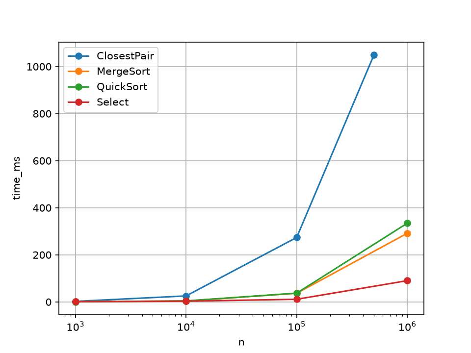
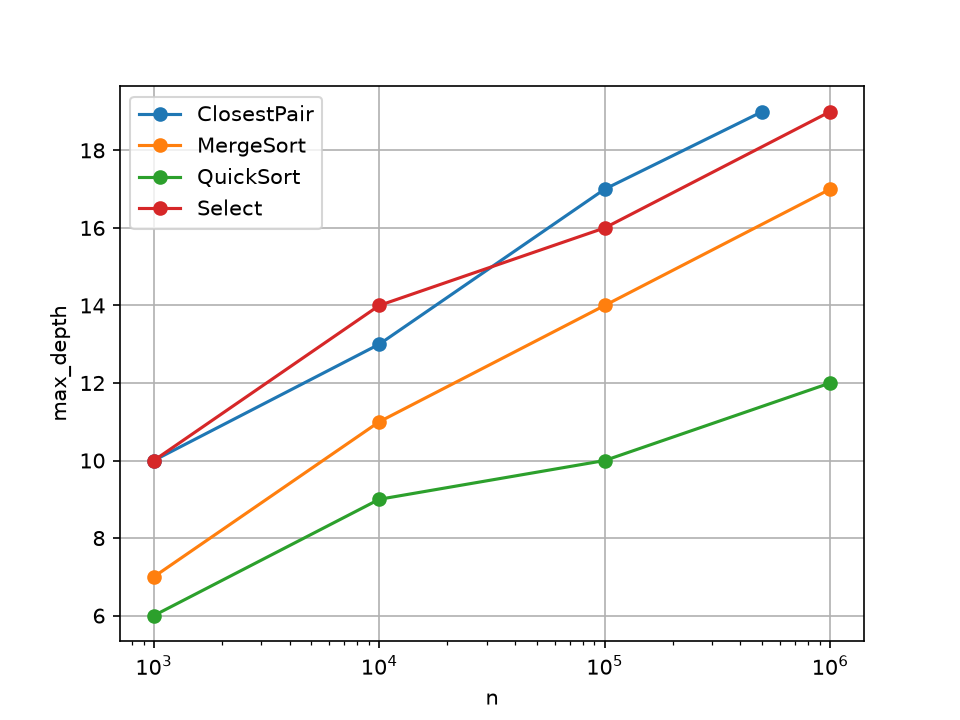
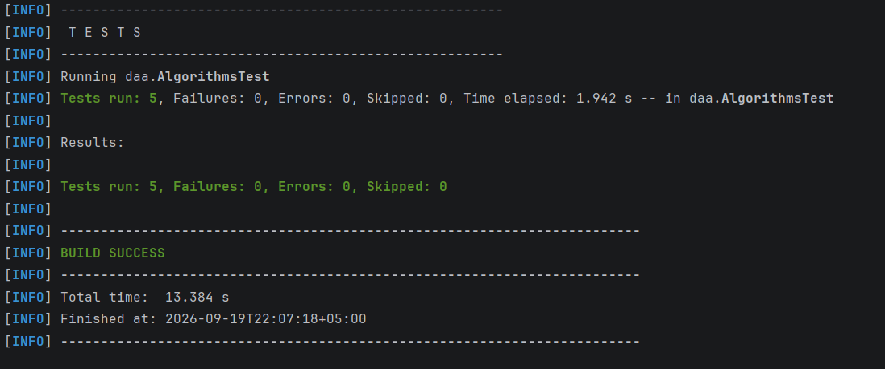

# Assignment 1: Divide-and-Conquer Algorithm Analysis

## A. Project Overview

**Purpose.** This project implements four classic divide-and-conquer algorithms in Java, checks their correctness against reference solutions, and compares their measured performance with the theoretical running times.

**Implemented algorithms**

| Algorithm | Class | Key features |
|---|---|---|
| MergeSort | `MergeSorter` | linear merge, one reusable buffer, insertion-sort cutoff (16) |
| QuickSort | `QuickSorter` | random pivot, in-place 3-way partition, recurse into the smaller part and loop over the larger |
| Deterministic Select | `DeterministicSelector` | groups of 5, median-of-medians pivot, in-place partition, recurse only into the needed side |
| Closest Pair of Points | `ClosestPairSolver` | sort by x once, recursive split, y-order merge, strip check |

Supporting classes: `Point` (2D point), `Metrics` (comparison, call and depth counters), `Experiment` (input generation, timing, CSV output), `Main` (entry point).

**How to run**

```
mvn test                      # correctness tests
run daa.Main                  # experiments -> results/results.csv
python docs/plots/plot.py     # plots -> docs/plots/
```

Requirements: JDK 17+, Maven (or IntelliJ IDEA with its bundled Maven), Python 3 with `pandas` and `matplotlib` for the plots.

---

## B. Algorithm Analysis

### 1. MergeSort
**How it works.** The array is split in half, each half is sorted recursively, and the two sorted halves are merged in linear time. A single auxiliary buffer is allocated once and reused in every merge. Subarrays of at most 16 elements are sorted with insertion sort, which avoids recursion overhead on tiny inputs.

**Recurrence.** T(n) = 2T(n/2) + Θ(n).
**Master Theorem.** a = 2, b = 2, f(n) = Θ(n) = Θ(n^(log₂2)), so Case 2 applies: **T(n) = Θ(n log n)** in every case.
**Space.** Θ(n) for the buffer plus O(log n) recursion stack.

### 2. QuickSort
**How it works.** A random element is chosen as the pivot. The range is partitioned in place into three parts (less than, equal to, greater than the pivot). The algorithm recurses into the **smaller** side and continues in a loop on the larger side.

**Recurrence.**
- Expected: T(n) = T(k) + T(n − k − 1) + Θ(n) with a random k, which solves to Θ(n log n). With balanced splits this is T(n) = 2T(n/2) + Θ(n), Master Case 2.
- Worst case: T(n) = T(n − 1) + Θ(n) = Θ(n²). Random pivots make this extremely unlikely.

**Space.** In place. Because only the smaller part is handled by recursion, the stack depth is at most log₂ n, so O(log n).

### 3. Deterministic Select (Median-of-Medians)
**How it works.** To find the k-th smallest element: split the range into groups of 5, sort each group and take its median, find the median of these medians recursively, and use it as the pivot. Partition around the pivot and continue only in the side that contains index k.

**Recurrence.** The pivot is guaranteed to have at least about 3n/10 elements on each side, so the recursive call on the partition has size at most 7n/10. The median-of-medians call has size n/5:

T(n) ≤ T(n/5) + T(7n/10) + Θ(n).

**Akra–Bazzi intuition.** The sum of the fractions is 1/5 + 7/10 = 9/10 < 1. Because it is strictly below 1, the work shrinks geometrically from level to level, and the total is bounded by c·n·(1 + 9/10 + (9/10)² + …) = 10c·n. Hence **T(n) = Θ(n)** in the worst case. (Master Theorem does not apply directly since the subproblems have different sizes.)
**Space.** In place, O(log n) stack.

### 4. Closest Pair of Points
**How it works.** Points are sorted by x once. The set is split by the median x-coordinate, the closest pair is found recursively in each half, and δ = min(δ_left, δ_right). Points are merged by y during the recursion. Only points within distance δ of the dividing line form the strip, and each strip point is compared only with the previous strip points whose y differs by less than δ. A geometric packing argument shows that at most a constant number (≤ 7) of comparisons is needed for each point.

**Recurrence.** T(n) = 2T(n/2) + Θ(n) (the merge and the strip scan are linear). Master Case 2 gives **T(n) = Θ(n log n)**, plus Θ(n log n) for the initial sort.
**Space.** Θ(n) for the temporary array, O(log n) stack.

---

## C. Experimental Results

**Setup.** Java `System.nanoTime()`, 2 warm-up runs before each measured run (JIT), fixed random seed. Input sizes: 1,000 / 10,000 / 100,000 / 1,000,000 (Closest Pair: up to 500,000). Input types: random, sorted, reverse-sorted, duplicate-heavy (values in 0–9). Metrics: time (ms), maximum recursion depth, comparisons, recursive calls. All raw data is in [`results/results.csv`](results/results.csv).

### Execution time (ms), random input

| n | MergeSort | QuickSort | Select (median) | ClosestPair |
|---|---|---|---|---|
| 1,000 | 0.992 | 0.409 | 0.770 | 2.264 |
| 10,000 | 3.845 | 4.231 | 3.099 | 25.425 |
| 100,000 | 36.732 | 37.249 | 11.147 | 273.899 |
| 1,000,000 | 291.778 | 334.435 | 90.343 | 1050.361 |

### Execution time (ms) by input type, n = 1,000,000

| Type | MergeSort | QuickSort | Select |
|---|---|---|---|
| random | 291.778 | 334.435 | 90.343 |
| sorted | 73.085 | 177.394 | 42.001 |
| reverse | 82.270 | 155.321 | 45.122 |
| duplicates | 144.332 | 39.864 | 38.772 |

### Maximum recursion depth, random input

| n | MergeSort | QuickSort | Select | ClosestPair |
|---|---|---|---|---|
| 1,000 | 7 | 6 | 10 | 10 |
| 10,000 | 11 | 9 | 14 | 13 |
| 100,000 | 14 | 10 | 16 | 17 |
| 1,000,000 | 17 | 12 | 19 | 19* |

### Plots





---

## D. Discussion

**Do the results match the theoretical complexity?**
Largely yes. When n grows tenfold, the running time of MergeSort, QuickSort and Closest Pair should grow by a little more than 10× (n log n), and Select should grow by about 10× (linear). *(Add your observed ratios, e.g. "MergeSort: 100k → 1M took … ms → … ms, ratio …".)* Deviations from the exact ratios come from constant factors, JIT compilation and cache effects (see below). Recursion depth of MergeSort matches log₂(n/16) because of the cutoff, and QuickSort's depth stays far below n thanks to the smaller-first strategy.

**How does input structure affect performance?**
QuickSort uses a random pivot, so sorted and reverse-sorted inputs do not trigger the quadratic worst case that a fixed pivot would. The 3-way partition makes duplicate-heavy inputs faster, because all elements equal to the pivot are excluded from further recursion. MergeSort's running time is almost independent of order; sorted inputs are slightly faster because merging has more predictable branches. Select behaves similarly on all types because its pivot is chosen deterministically. *(Confirm with your table.)*

**Why does smaller-first recursion help QuickSort?**
Each recursive call handles at most half of the current range, so the recursion depth is bounded by log₂ n even when partitions are unbalanced. The larger part is processed by the loop and does not add a stack frame. This prevents stack overflow on unlucky splits and keeps space O(log n), while the running time is unchanged.

**Why does Median-of-Medians guarantee O(n)?**
The chosen pivot is greater than about half of the group medians, and each of those medians is greater than two elements of its group. So at least ≈ 3n/10 elements are smaller and ≈ 3n/10 are larger than the pivot, which leaves at most 7n/10 elements for the next step. The recurrence T(n) ≤ T(n/5) + T(7n/10) + cn has fractions summing to 9/10 < 1, so the total work is a geometric series bounded by 10cn.

**Why is divide-and-conquer Closest Pair faster than O(n²) for large inputs?**
Brute force checks all n(n − 1)/2 pairs. The divide-and-conquer version only combines the two halves through a strip of width 2δ, where each point has to be compared with a constant number of neighbours in y order. The combine step is therefore linear, giving T(n) = 2T(n/2) + Θ(n) = Θ(n log n). For n = 500,000 that is roughly 10⁷ operations instead of about 10¹¹.

**What practical factors affect performance?**
- **JVM/JIT:** the first runs are slower because code is interpreted; warm-up runs reduce this.
- **Garbage collection:** MergeSort allocates a buffer and Closest Pair allocates `Point` objects and temporary arrays, so GC pauses can appear in timings.
- **Cache:** MergeSort accesses memory sequentially and is cache-friendly; QuickSort partitions in place; Select has a larger constant because of extra passes (group sorting, extra recursion) and less regular access.
- **Constant factors:** Θ(n) Select is often slower in practice than a sort-based approach on moderate n, since its hidden constant is large.
- **Machine noise:** other processes, CPU frequency scaling, and heap size (`-Xmx`).

---

## E. Reflection

*(Rewrite this in your own words and mention your actual experience. Draft:)*

Through this assignment I learned how a recurrence translates into real running time and memory use. Implementing the algorithms made the theory concrete: for example, seeing that the recursion depth of QuickSort stays logarithmic only because the larger part is processed iteratively, and understanding why the group size of 5 and the 9/10 sum in the Median-of-Medians recurrence make the worst-case bound linear. I also learned to measure carefully: warm-up runs, fixed seeds and separate counters for depth and comparisons were necessary to obtain results that could be compared with the theory.

The main implementation challenges were: (1) the median-of-medians select with absolute indices in place, where moving medians to the front of the range without corrupting the data was easy to get wrong; (2) making the Closest Pair merge by y inside the recursion so that the complexity is really Θ(n log n) and not Θ(n log² n); (3) handling duplicates correctly, which led to the 3-way partition; and (4) setting up Maven and JUnit so the tests run reliably.

---

## F. Screenshots

**Program output**


**Test results**



**Plots / results**


---

## Repository structure

```
assignment1-divide-and-conquer/
├── src/main/java/daa/   (algorithms, Experiment, Main)
├── src/test/java/daa/   (JUnit tests)
├── tests/
├── docs/screenshots/
├── docs/plots/
├── results/results.csv
├── README.md
├── pom.xml

```